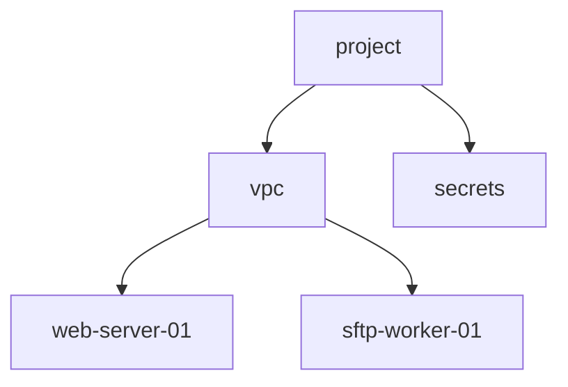

# Terragrunt GCP MCP Tool

A Model Context Protocol (MCP) server tool for managing Google Cloud Platform infrastructure using Terragrunt. This tool provides intelligent automation and management capabilities for the terragrunt-gcp-org-automation codebase with support for **Terragrunt Experimental Features**.

## Features

### 🧪 Experimental Features Support
- **Terragrunt Stacks**: Enhanced dependency management and parallel execution using the experimental stacks feature
- **Enhanced Dependency Resolution**: Improved dependency analysis and execution ordering
- **Stack-Level Operations**: Execute commands across multiple units with intelligent dependency handling
- **Parallel Execution**: Run multiple units in parallel within stacks for faster deployments
- **Stack Outputs**: Aggregate and manage outputs at the stack level

### Resource Management
- **Add New Resources**: Create new infrastructure resources with templates
- **Query Resources**: Inspect existing resource configurations and states
- **Update Resources**: Modify resource configurations safely
- **Delete Resources**: Remove resources with dependency checking

### Deployment Operations
- **Check Status**: Monitor deployment status and health
- **Trigger Deployments**: Initiate infrastructure deployments
- **Plan Changes**: Generate and review infrastructure plans
- **Rollback**: Revert failed or unwanted changes

### Monitoring & Notifications
- **Status Monitoring**: Track infrastructure state and changes
- **Team Notifications**: Send updates to Slack channels
- **Alert Management**: Configure and manage infrastructure alerts
- **Audit Logging**: Track all operations and changes

### Advanced Features
- **Dependency Analysis**: Understand resource dependencies
- **Environment Management**: Handle dev/staging/production environments
- **Template Management**: Create and manage infrastructure templates
- **Cost Analysis**: Monitor and optimize infrastructure costs

### Terragrunt CLI Redesign Support
- **New Command Structure**: Uses the latest Terragrunt CLI redesign with `run` commands
- **Environment Variables**: Updated to use `TG_` prefixed environment variables
- **Backend Bootstrap**: Automatic backend resource provisioning with `--backend-bootstrap`
- **Dependency Discovery**: Enhanced dependency graph analysis with `find` and `list` commands
- **Run All Operations**: Support for `run --all` commands across multiple units

## Installation

```bash
# Clone the repository
git clone <repository-url>
cd terragrunt-gcp-tool-mcp

# Install dependencies
pip install -r requirements.txt

# Or install in development mode
pip install -e .

# Configure the MCP server
cp config/config.example.yaml config/config.yaml
# Edit config.yaml with your settings
```

## Configuration

Create a `config/config.yaml` file with your settings:

```yaml
# GCP Configuration
gcp:
  project_id: "your-project-id"
  credentials_path: "/path/to/credentials.json"
  default_region: "europe-west2"

# Terragrunt Configuration
terragrunt:
  root_path: "/path/to/terragrunt-gcp-org-automation"
  binary_path: "terragrunt"
  terraform_binary: "tofu"
  
  # Experimental features configuration
  experimental:
    # Stacks feature (experimental)
    stacks_enabled: true                    # Enable Terragrunt stacks experimental feature
    enhanced_dependency_resolution: true    # Use enhanced dependency resolution
    parallel_execution: true                # Enable parallel execution within stacks
    stack_outputs: true                     # Enable stack-level outputs
    recursive_stacks: false                 # Enable recursive stacks (not yet stable)
    
    # Stack execution settings
    max_parallel_units: 10                  # Maximum number of units to execute in parallel
    stack_timeout: 7200                     # Timeout for stack operations in seconds (2 hours)
    continue_on_error: false                # Continue stack execution on unit errors

# Slack Configuration (optional)
slack:
  webhook_url: "https://hooks.slack.com/..."
  default_channel: "#infrastructure"

# Monitoring Configuration
monitoring:
  enabled: true
  check_interval: 300  # seconds
```

## Usage

### Running as MCP Server

There are several ways to start the MCP server:

#### Option 1: Using the startup script (Recommended)
```bash
# Start the MCP server with default config
python3 run_server.py

# Start with custom config file
python3 run_server.py config/config.yaml
```

#### Option 2: Using the module directly
```bash
# Start the MCP server
python3 -m terragrunt_gcp_mcp.server

# With custom config
python3 -m terragrunt_gcp_mcp.server config/config.yaml
```

#### Option 3: Using the CLI
```bash
# Initialize configuration first
python3 -m terragrunt_gcp_mcp.cli init

# Start the server
python3 -m terragrunt_gcp_mcp.cli server

# Other CLI commands
python3 -m terragrunt_gcp_mcp.cli list-resources
python3 -m terragrunt_gcp_mcp.cli status
```

The server will be available for MCP clients to connect via stdio.

### Using with Claude Desktop

Add to your Claude Desktop MCP configuration:

```json
{
  "mcpServers": {
    "terragrunt-gcp": {
      "command": "python3",
      "args": ["-m", "terragrunt_gcp_mcp.server"],
      "cwd": "/path/to/terragrunt-gcp-tool-mcp"
    }
  }
}
```

### Available Tools

The MCP server provides these tools:

#### 🧪 Experimental Stacks Tools
- `list_stacks` - List all Terragrunt stacks using experimental features
- `get_stack_details` - Get detailed information about a specific stack including units and execution order
- `execute_stack_command` - Execute commands on stacks with parallel execution and dependency management
- `get_stack_outputs` - Get aggregated outputs from stack-level operations
- `get_enhanced_infrastructure_status` - Get comprehensive status including both traditional resources and stacks

#### Resource Management
- `list_resources` - List all resources in the infrastructure
- `get_resource` - Get detailed information about a specific resource (deprecated, use get_resource_details)
- `get_resource_details` - Get comprehensive information about a specific resource including attributes, state, and configuration
- `validate_resource_config` - Validate a Terragrunt resource configuration with dependency checking
- `create_resource` - Create a new infrastructure resource
- `update_resource` - Update an existing resource configuration
- `delete_resource` - Delete a resource (with dependency checking)

#### Visualization & Tree Drawing (New!)
- `draw_resource_tree` - Draw a visual resource tree using Terragrunt CLI redesign commands
- `get_dependency_graph` - Generate dependency graphs in DOT, Mermaid, or JSON format
- `visualize_infrastructure` - Comprehensive infrastructure visualization with multiple formats

#### Deployment Operations
- `plan_deployment` - Generate deployment plan for changes (deprecated, use plan_resource_deployment)
- `plan_resource_deployment` - Generate a comprehensive deployment plan for a Terragrunt resource
- `deploy_resources` - Deploy infrastructure changes (deprecated, use apply_resource_deployment)
- `apply_resource_deployment` - Apply changes to a Terragrunt resource with safety checks
- `check_deployment_status` - Check status of ongoing deployments
- `rollback_deployment` - Rollback a failed deployment

#### Monitoring & Analysis
- `get_infrastructure_status` - Get overall infrastructure health
- `analyze_dependencies` - Analyze resource dependencies
- `get_cost_analysis` - Get infrastructure cost breakdown
- `check_drift` - Detect configuration drift

#### Team Collaboration
- `send_slack_notification` - Send notifications to team
- `create_deployment_summary` - Generate deployment reports
- `get_audit_log` - Retrieve audit logs

## Examples

### 🧪 Using Experimental Stacks Features

#### CLI Usage
```bash
# List all stacks
python3 -m terragrunt_gcp_mcp.cli --config config/config.yaml list-stacks

# Get detailed information about a specific stack
python3 -m terragrunt_gcp_mcp.cli --config config/config.yaml get-stack-details "live/dev-account/test-dev/dev-99"

# Execute a command on a stack (with parallel execution)
python3 -m terragrunt_gcp_mcp.cli --config config/config.yaml execute-stack-command "live/dev-account/test-dev/dev-99" plan --dry-run

# Get stack outputs
python3 -m terragrunt_gcp_mcp.cli --config config/config.yaml get-stack-outputs "live/dev-account/test-dev/dev-99"

# Get enhanced infrastructure status including stacks
python3 -m terragrunt_gcp_mcp.cli --config config/config.yaml status --include-stacks
```

### 🌳 Resource Tree Visualization (New!)

#### CLI Usage
```bash
# Draw a basic resource tree
python3 -m terragrunt_gcp_mcp.cli --config config/config.yaml draw-tree

# Draw tree for specific environment
python3 -m terragrunt_gcp_mcp.cli --config config/config.yaml draw-tree --environment dev-99

# Draw tree with limited depth
python3 -m terragrunt_gcp_mcp.cli --config config/config.yaml draw-tree --max-depth 3

# Generate dependency graph in DOT format (for Graphviz)
python3 -m terragrunt_gcp_mcp.cli --config config/config.yaml dependency-graph --format dot

# Generate dependency graph in Mermaid format
python3 -m terragrunt_gcp_mcp.cli --config config/config.yaml dependency-graph --format mermaid

# Comprehensive visualization
python3 -m terragrunt_gcp_mcp.cli --config config/config.yaml visualize --type tree --format ascii
python3 -m terragrunt_gcp_mcp.cli --config config/config.yaml visualize --type dag --format mermaid

# Get tree data in JSON format
python3 -m terragrunt_gcp_mcp.cli --config config/config.yaml draw-tree --format json
```

#### MCP Usage
```python
# Example: Draw a resource tree
result = draw_resource_tree(
    environment="dev-99",
    format="tree",
    include_dependencies=True,
    max_depth=4
)

# Example: Generate dependency graph
result = get_dependency_graph(
    environment="dev-99",
    output_format="mermaid"
)

# Example: Comprehensive visualization
result = visualize_infrastructure(
    environment="dev-99",
    visualization_type="tree",
    include_dependencies=True,
    output_format="ascii"
)

# Example: List all stacks (experimental)
result = list_stacks(environment="dev-99")

# Example: Get stack details with units and execution order (experimental)
result = get_stack_details(stack_path="live/dev-account/test-dev/dev-99")

# Example: Execute a plan command on a stack (experimental)
result = execute_stack_command(
    stack_path="live/dev-account/test-dev/dev-99",
    command="plan",
    dry_run=True
)

# Example: Get enhanced status including stacks (experimental)
result = get_enhanced_infrastructure_status(
    environment="dev-99",
    include_stacks=True,
    include_costs=False
)
```

#### Example Tree Output
```
Infrastructure
├── dev-account
│   └── test-dev
│       └── dev-99 (folder)
│           ├── project (project)
│           ├── europe-west2 (folder)
│           │   ├── vpc (vpc-network) [deps: 1]
│           │   ├── compute (folder)
│           │   │   ├── web-server-01 (compute) [deps: 2]
│           │   │   └── sftp-worker-01 (compute) [deps: 2]
│           │   └── secrets (folder)
│           │       └── sftp-sshfs-host (secrets) [deps: 1]
│           └── bigquery (folder)
│               └── dataset-01 (bigquery) [deps: 1]
```

#### Example Dependency Graph (Mermaid)


### Validating Resources

#### CLI Usage
```bash
# Validate a resource with dependency checking
python3 -m terragrunt_gcp_mcp.cli --config config/config.yaml validate-resource "web-server-01"

# Validate without checking dependencies
python3 -m terragrunt_gcp_mcp.cli --config config/config.yaml validate-resource "web-server-01" --no-check-dependencies

# Get validation results in JSON format
python3 -m terragrunt_gcp_mcp.cli --config config/config.yaml validate-resource "web-server-01" --format json

# New CLI redesign commands
# Find and discover Terragrunt configurations (replaces output-module-groups)
python3 -m terragrunt_gcp_mcp.cli --config config/config.yaml find --dag --json --dependencies

# List units with dependency information (replaces graph-dependencies)
python3 -m terragrunt_gcp_mcp.cli --config config/config.yaml list-units --dag --tree

# Generate dependency graph
python3 -m terragrunt_gcp_mcp.cli --config config/config.yaml dag-graph --format json

# Run commands across all units (uses 'run --all' internally)
python3 -m terragrunt_gcp_mcp.cli --config config/config.yaml run-all plan --environment test-dev
python3 -m terragrunt_gcp_mcp.cli --config config/config.yaml run-all apply --dry-run
```

#### MCP Usage
```python
# Example: Validate a resource configuration
result = validate_resource_config(
    resource_path="live/dev-account/test-dev/dev-99/europe-west2/compute/web-server-01",
    check_dependencies=True
)
```

### Planning Deployments

#### CLI Usage
```bash
# Generate a deployment plan (dry-run by default)
python3 -m terragrunt_gcp_mcp.cli --config config/config.yaml plan-deployment "web-server-01"

# Generate a plan and save it for later use
python3 -m terragrunt_gcp_mcp.cli --config config/config.yaml plan-deployment "web-server-01" --save-plan

# Get plan results in JSON format
python3 -m terragrunt_gcp_mcp.cli --config config/config.yaml plan-deployment "web-server-01" --format json
```

#### MCP Usage
```python
# Example: Generate a deployment plan
result = plan_resource_deployment(
    resource_path="live/dev-account/test-dev/dev-99/europe-west2/compute/web-server-01",
    dry_run=True,
    save_plan=True
)
```

### Applying Deployments

#### CLI Usage
```bash
# Apply deployment with confirmation prompt
python3 -m terragrunt_gcp_mcp.cli --config config/config.yaml apply-deployment "web-server-01"

# Apply deployment with auto-approval (bypasses validation)
python3 -m terragrunt_gcp_mcp.cli --config config/config.yaml apply-deployment "web-server-01" --auto-approve

# Apply using a specific plan file
python3 -m terragrunt_gcp_mcp.cli --config config/config.yaml apply-deployment "web-server-01" --plan-file "tfplan"

# Apply without notifications
python3 -m terragrunt_gcp_mcp.cli --config config/config.yaml apply-deployment "web-server-01" --no-notify
```

#### MCP Usage
```python
# Example: Apply deployment with safety checks
result = apply_resource_deployment(
    resource_path="live/dev-account/test-dev/dev-99/europe-west2/compute/web-server-01",
    auto_approve=False,
    plan_file=None,
    notify_on_completion=True
)
```

### Complete Workflow Example

#### CLI Workflow
```bash
# 1. Validate the resource first
python3 -m terragrunt_gcp_mcp.cli --config config/config.yaml validate-resource "web-server-01"

# 2. Generate and review the deployment plan
python3 -m terragrunt_gcp_mcp.cli --config config/config.yaml plan-deployment "web-server-01" --save-plan

# 3. Apply the deployment
python3 -m terragrunt_gcp_mcp.cli --config config/config.yaml apply-deployment "web-server-01"
```

#### 🧪 Experimental Stacks Workflow
```bash
# 1. List available stacks
python3 -m terragrunt_gcp_mcp.cli --config config/config.yaml list-stacks

# 2. Get stack details and execution order
python3 -m terragrunt_gcp_mcp.cli --config config/config.yaml get-stack-details "dev-99"

# 3. Plan the entire stack
python3 -m terragrunt_gcp_mcp.cli --config config/config.yaml execute-stack-command "dev-99" plan --dry-run

# 4. Apply the stack with parallel execution
python3 -m terragrunt_gcp_mcp.cli --config config/config.yaml execute-stack-command "dev-99" apply
```

#### MCP Workflow
```python
# Complete deployment workflow via MCP
# 1. Validate
validation = validate_resource_config("web-server-01", check_dependencies=True)

# 2. Plan
if validation.success:
    plan = plan_resource_deployment("web-server-01", dry_run=True, save_plan=True)
    
    # 3. Apply
    if plan.success and plan.data["plan"]["changes_summary"]["has_changes"]:
        deployment = apply_resource_deployment(
            "web-server-01", 
            auto_approve=False, 
            notify_on_completion=True
        )
```

### Querying Individual Resources

```bash
# Get detailed information about a specific resource
python3 -m terragrunt_gcp_mcp.cli --config config/config.yaml get-resource "web-server-01"

# Get resource info with full configuration
python3 -m terragrunt_gcp_mcp.cli --config config/config.yaml get-resource "live/dev-account/test-dev/dev-99/europe-west2/compute/web-server-01" --include-config

# Get resource info in JSON format
python3 -m terragrunt_gcp_mcp.cli --config config/config.yaml get-resource "sftp-worker-01" --format json
```

### Creating a New Compute Instance

```python
# Example: Create a new compute instance
result = create_resource(
    resource_type="compute",
    resource_name="web-server-02",
    environment="dev-99",
    region="europe-west2",
    configuration={
        "machine_type": "e2-medium",
        "disk_size_gb": 50,
        "tags": ["web-server", "api"]
    }
)
```

### Getting Resource Details via MCP

```python
# Example: Get detailed resource information
result = get_resource_details(
    resource_path="live/dev-account/test-dev/dev-99/europe-west2/compute/web-server-01",
    include_configuration=True
)
```

### Deploying Changes

```python
# Example: Deploy specific resources
result = deploy_resources(
    resources=["live/dev-account/test-dev/dev-99/europe-west2/compute/web-server-02"],
    dry_run=False,
    notify_slack=True
)
```

### Monitoring Status

```python
# Example: Check infrastructure status
status = get_infrastructure_status(
    environment="dev-99",
    include_costs=True,
    include_health=True
)
```

## 🧪 Experimental Features

This tool supports Terragrunt's experimental features as documented in the [Terragrunt Experiments documentation](https://terragrunt.gruntwork.io/docs/reference/experiments/).

### Stacks Feature

The **Stacks** experimental feature provides:

- **Enhanced Dependency Management**: Automatic dependency resolution and execution ordering
- **Parallel Execution**: Run multiple units in parallel within stacks
- **Stack-Level Operations**: Execute commands across entire stacks
- **Improved Error Handling**: Better error reporting and recovery
- **Stack Outputs**: Aggregate outputs at the stack level

#### Configuration

Enable experimental features in your `config.yaml`:

```yaml
terragrunt:
  experimental:
    stacks_enabled: true                    # Enable stacks feature
    enhanced_dependency_resolution: true    # Enhanced dependency analysis
    parallel_execution: true                # Parallel unit execution
    stack_outputs: true                     # Stack-level outputs
    max_parallel_units: 10                  # Max parallel units
    stack_timeout: 7200                     # Stack operation timeout
```

#### Stack Structure

Stacks are defined using `stack.hcl` files in your Terragrunt structure:

```
live/
├── dev-account/
│   └── test-dev/
│       └── dev-99/
│           ├── stack.hcl              # Stack definition
│           ├── project/
│           │   └── terragrunt.hcl     # Unit 1
│           ├── compute/
│           │   └── terragrunt.hcl     # Unit 2
│           └── secrets/
│               └── terragrunt.hcl     # Unit 3
```

#### Benefits

1. **Faster Deployments**: Parallel execution of independent units
2. **Better Dependency Management**: Automatic dependency resolution
3. **Improved Reliability**: Enhanced error handling and retry mechanisms
4. **Stack-Level Visibility**: Aggregate status and outputs
5. **Simplified Operations**: Single commands for complex deployments

## Architecture

```
┌─────────────────┐    ┌──────────────────┐    ┌─────────────────┐
│   MCP Client    │    │   MCP Server     │    │   Terragrunt    │
│   (Claude)      │◄──►│   (This Tool)    │◄──►│   Infrastructure│
└─────────────────┘    └──────────────────┘    └─────────────────┘
                                │                        │
                                ▼                        ▼
                       ┌──────────────────┐    ┌─────────────────┐
                       │   External APIs  │    │ 🧪 Experimental │
                       │   • GCP APIs     │    │   Stacks        │
                       │   • Slack API    │    │   • Enhanced    │
                       │   • GitHub API   │    │     Dependencies│
                       └──────────────────┘    │   • Parallel    │
                                              │     Execution   │
                                              └─────────────────┘
```

## Security

- **Credential Management**: Supports multiple GCP authentication methods
- **Permission Validation**: Checks permissions before operations
- **Audit Logging**: All operations are logged for security auditing
- **Safe Operations**: Dry-run mode for testing changes

## Contributing

1. Fork the repository
2. Create a feature branch
3. Make your changes
4. Add tests for new functionality
5. Submit a pull request

## License

GNU General Public License v3.0 - see LICENSE.md for details.

## Support

For issues and questions:
- Create an issue in the repository
- Check the documentation in `/docs`
- Review the examples in `/examples`
